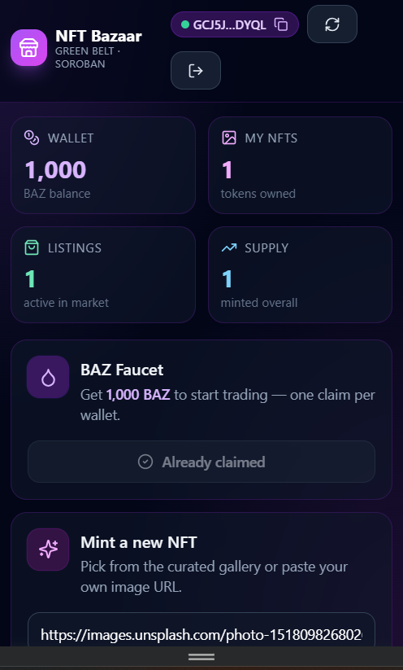

# 🟢 NFT Bazaar — Green Belt

[](https://nft-bazaar.onrender.com)

[](https://github.com/anyhonyde123-glitch/nft-bazaar/actions/workflows/ci.yml)
[](https://stellar.expert/explorer/testnet)
[](#-tests)
[](#-license)

A three-contract NFT marketplace on Stellar Soroban demonstrating **3 inter-contract calls per buy**, an open token **faucet**, real on-chain ownership, mobile-responsive UI, and a CI/CD pipeline.

> **Stellar Frontend Challenge — Level 4 (Green Belt) submission.**

**🌐 Try it now → https://nft-bazaar.onrender.com**

---

## 🎯 What it does

Users **mint** NFTs (open mint, anyone can create), **claim** free `BAZ` tokens from the faucet, **list** any NFT they own for sale, and **buy** other people's listings. Every purchase performs **three on-chain inter-contract calls** in a single transaction:

1. `payment.transfer(buyer → seller, price - fee)`
2. `payment.transfer(buyer → admin, fee)` (2.5 % marketplace fee)
3. `nft.transfer_from(marketplace, seller → buyer, token_id)` (using pre-approved spender)

---

## 🚀 Live deployment (testnet)

| Contract           | Address | Explorer |
| ------------------ | ------- | -------- |
| **NFT** (BZR)      | `CDWSPPA55HFRPLUYEIRSY4BDCYOGJAYZEFI7JNDMS422QUF2RAWC3JLL` | [view](https://stellar.expert/explorer/testnet/contract/CDWSPPA55HFRPLUYEIRSY4BDCYOGJAYZEFI7JNDMS422QUF2RAWC3JLL) |
| **Payment** (BAZ)  | `CB6PLDFF6QPDV3YBTIDYWONLMGYMZMQSTH2UI2IUJAW6J6UMEYC3B2JB` | [view](https://stellar.expert/explorer/testnet/contract/CB6PLDFF6QPDV3YBTIDYWONLMGYMZMQSTH2UI2IUJAW6J6UMEYC3B2JB) |
| **Marketplace**    | `CAFMVYB4QHR6DYBOWTSNLS2YZHVVMRZ45KMZRWP2S5HW4NQ52TQZIEUW` | [view](https://stellar.expert/explorer/testnet/contract/CAFMVYB4QHR6DYBOWTSNLS2YZHVVMRZ45KMZRWP2S5HW4NQ52TQZIEUW) |

> The deploy script (`scripts/deploy.ps1`) prints these IDs and writes them to `.env.local` automatically.

### Sample on-chain transactions

| Action | Tx hash |
| ------ | ------- |
| NFT contract deploy   | [`3ba2fa13c1b6459ad7893b438b5233b7ef21e149423dfa86264c331e69c6e428`](https://stellar.expert/explorer/testnet/tx/3ba2fa13c1b6459ad7893b438b5233b7ef21e149423dfa86264c331e69c6e428) |
| Payment contract deploy | [`fa788500405b8266ef4adcf15554bf61dfcf30d9d411944f92dfe47e068c3098`](https://stellar.expert/explorer/testnet/tx/fa788500405b8266ef4adcf15554bf61dfcf30d9d411944f92dfe47e068c3098) |
| Marketplace deploy    | [`845e9eebb022d87cb1f0490c124dd12ab3bb79bc27a563c2a23007aceaf61b09`](https://stellar.expert/explorer/testnet/tx/845e9eebb022d87cb1f0490c124dd12ab3bb79bc27a563c2a23007aceaf61b09) |
| Marketplace init      | [`72e654a0dd02495a0f5d322243d20684be1a78415e499ca94cb74c12743e7b3c`](https://stellar.expert/explorer/testnet/tx/72e654a0dd02495a0f5d322243d20684be1a78415e499ca94cb74c12743e7b3c) |

---

## ✨ Features

- 🖼️ **Open NFT mint** — anyone can mint with any image URL or pick from 6 curated presets
- 💧 **One-time faucet** — claim 1,000 BAZ per wallet to start trading
- 🏪 **Marketplace** with `list` / `buy` / `cancel` and a 2.5 % protocol fee
- 🔗 **3 inter-contract calls per buy** (payment ↔ marketplace ↔ NFT)
- 🪪 **Multi-wallet** via StellarWalletsKit (Freighter, xBull, Albedo, Lobstr, Hana)
- 🔄 **Switch-account button** — fresh wallet picker on every connect
- 📱 **Mobile responsive** — works edge-to-edge on phones (Tailwind mobile-first)
- 🛡️ **10 contract error variants** mapped to friendly UI messages
- ✅ **27 unit tests** (8 NFT + 7 payment + 12 marketplace)
- 🤖 **GitHub Actions CI** — runs `cargo test --workspace` + frontend build on every push
- 🛰️ **Stellar Expert links** on every transaction toast

---

## 🧪 Tests

```bash
cd contracts && cargo test --workspace
```

```
running 8 tests (nft)
test test::init_sets_metadata           ok
test test::double_init_rejected         ok
test test::mint_assigns_owner_and_uri   ok
test test::empty_uri_rejected           ok
test test::transfer_moves_ownership     ok
test test::transfer_non_owner_rejected  ok
test test::approve_lets_spender_transfer ok
test test::unknown_token_returns_error  ok
test result: ok. 8 passed

running 7 tests (payment)
test test::init_metadata                  ok
test test::admin_mint_and_balance         ok
test test::faucet_grants_once             ok
test test::faucet_double_claim_rejected   ok
test test::transfer_moves_balance         ok
test test::transfer_insufficient_rejected ok
test test::negative_amount_rejected       ok
test result: ok. 7 passed

running 12 tests (marketplace)
test test::init_stores_addresses           ok
test test::double_init_rejected            ok
test test::fee_above_cap_rejected          ok
test test::list_requires_approval          ok
test test::list_success_after_approve      ok
test test::invalid_price_rejected          ok
test test::cancel_only_by_seller           ok
test test::buy_transfers_tokens_and_nft    ok  ← inter-contract calls verified
test test::buy_self_rejected               ok
test test::buy_insufficient_balance        ok
test test::buy_inactive_rejected           ok
test test::active_listings_pagination      ok
test result: ok. 12 passed
```

---

## 🧰 Tech stack

| Layer       | Tech |
| ----------- | ---- |
| Contracts   | Rust + `soroban-sdk` 22 (workspace, 3 members) |
| Frontend    | React 18 + Vite 6 + TypeScript |
| Styling     | TailwindCSS (mobile-first) + Lucide icons |
| Wallets     | StellarWalletsKit |
| Stellar SDK | `@stellar/stellar-sdk` 14 (Protocol 23) |
| CI          | GitHub Actions (Rust + Node) |

---

## 📁 Structure

```
nft-bazaar/
├── contracts/
│   ├── nft/             # Open-mint NFT collection
│   ├── payment/         # BAZ fungible token + faucet
│   └── marketplace/     # List / buy / cancel + inter-contract calls
├── src/
│   ├── components/      # WalletBar · Stats · MintForm · FaucetCard · MyNFTs · Marketplace
│   ├── lib/             # config · wallet · stellar (RPC) · format
│   ├── App.tsx
│   ├── main.tsx
│   └── index.css
├── scripts/
│   └── deploy.ps1       # Deploys + inits all 3 contracts in one shot
├── .github/workflows/ci.yml
├── render.yaml          # Render Blueprint
├── netlify.toml         # Netlify config (alt deploy)
└── README.md
```

---

## 🛠️ Setup

### Prerequisites
- Node 20+
- Rust + `wasm32v1-none` target
- Stellar CLI ≥ 22
- A wallet extension (Freighter recommended) on **testnet**

### Run locally
```bash
git clone https://github.com/anyhonyde123-glitch/nft-bazaar.git
cd nft-bazaar
npm install

# 1) Deploy all 3 contracts to testnet (one shot)
pwsh ./scripts/deploy.ps1

# 2) Start the dev server (env vars are auto-written by the script)
npm run dev
```
Open http://localhost:5180.

### Manual deploy (if you don't have PowerShell)

```bash
cd contracts && stellar contract build && cd ..
WASM=contracts/target/wasm32v1-none/release

# NFT
NFT=$(stellar contract deploy --wasm $WASM/nft.wasm --source alice --network testnet)
stellar contract invoke --id $NFT --source alice --network testnet -- init \
  --name '"NFT Bazaar"' --symbol '"BZR"'

# Payment token
PAY=$(stellar contract deploy --wasm $WASM/payment.wasm --source alice --network testnet)
ADMIN=$(stellar keys address alice)
stellar contract invoke --id $PAY --source alice --network testnet -- init \
  --admin $ADMIN --decimal 7 --name '"Bazaar Coin"' --symbol '"BAZ"'

# Marketplace
MARKET=$(stellar contract deploy --wasm $WASM/marketplace.wasm --source alice --network testnet)
stellar contract invoke --id $MARKET --source alice --network testnet -- init \
  --admin $ADMIN --nft $NFT --payment $PAY --fee_bps 250
```

---

## 🚀 Deploy your own (Render)

The repo ships a `render.yaml` Blueprint:

1. Fork this repo on GitHub.
2. Open https://dashboard.render.com → **New +** → **Static Site** → connect your fork.
3. Use these settings:

   | Field | Value |
   | --- | --- |
   | Name | `nft-bazaar` |
   | Branch | `main` |
   | Build Command | `npm install --no-audit --no-fund && npm run build` |
   | Publish Directory | `dist` |

4. Add env vars (paste IDs from `scripts/deploy.ps1` output):

   ```
   NODE_VERSION=20
   VITE_NETWORK_PASSPHRASE=Test SDF Network ; September 2015
   VITE_RPC_URL=https://soroban-testnet.stellar.org
   VITE_NFT_ID=…
   VITE_PAYMENT_ID=…
   VITE_MARKETPLACE_ID=…
   ```

5. Hit **Create Static Site**. Done in ~2 min.

---

## 🧠 Architecture: inter-contract calls

The marketplace defines two minimal client traits via `#[contractclient]` so the Soroban host can invoke both the NFT contract and the payment token contract from inside a single `buy()` call:

```rust
#[contractclient(name = "NftClient")]
pub trait NftInterface {
    fn owner_of(env: Env, token_id: u32) -> Address;
    fn transfer_from(env: Env, spender: Address, from: Address, to: Address, token_id: u32);
    fn get_approved(env: Env, token_id: u32) -> Option<Address>;
}

#[contractclient(name = "PaymentClient")]
pub trait PaymentInterface {
    fn balance(env: Env, id: Address) -> i128;
    fn transfer(env: Env, from: Address, to: Address, amount: i128);
}

// Inside `buy`:
let pay = PaymentClient::new(&env, &pay_addr);
let nft = NftClient::new(&env, &nft_addr);
pay.transfer(&buyer, &listing.seller, &net);                                       // call #1
pay.transfer(&buyer, &admin, &fee);                                                // call #2
nft.transfer_from(&env.current_contract_address(), &listing.seller, &buyer, &id);  // call #3
```

The buyer signs **one** transaction; Soroban's auth framework propagates `require_auth()` automatically through the call stack. The seller pre-approves the marketplace contract as the NFT spender at listing time, so they don't need to sign again at sale time.

---

## 📸 Screenshots

### CI/CD pipeline


The CI badge above is live — it goes green when both jobs (`Build + Test contracts` and `Build frontend`) succeed on `main`.

### Mobile responsive

Open the live demo on a phone (or Chrome DevTools → mobile mode 375 × 667). The layout collapses to a single column, NFT cards become a 2-up grid, and all buttons remain tap-friendly.



---

## ✅ Submission checklist (Green Belt)

- [x] **3 deployed contracts** with **3 inter-contract calls per buy()**
- [x] **27 unit tests passing**
- [x] **10 contract error variants** mapped to UI
- [x] Multi-wallet support + switch-account button
- [x] **Open faucet** (custom token mechanic)
- [x] **Custom NFT collection** with open mint
- [x] **Mobile-responsive UI** (Tailwind mobile-first, edge-to-edge)
- [x] Comprehensive README with badges, architecture, and tx hashes
- [x] **GitHub Actions CI** (cargo test + frontend build + dist artifact)
- [x] **10+ meaningful commits** in repo history
- [x] **Render Blueprint** (`render.yaml`) for one-click deploy
- [x] **Live deploy URL: https://nft-bazaar.onrender.com**

---

## 📜 License

MIT © anyhonyde123
